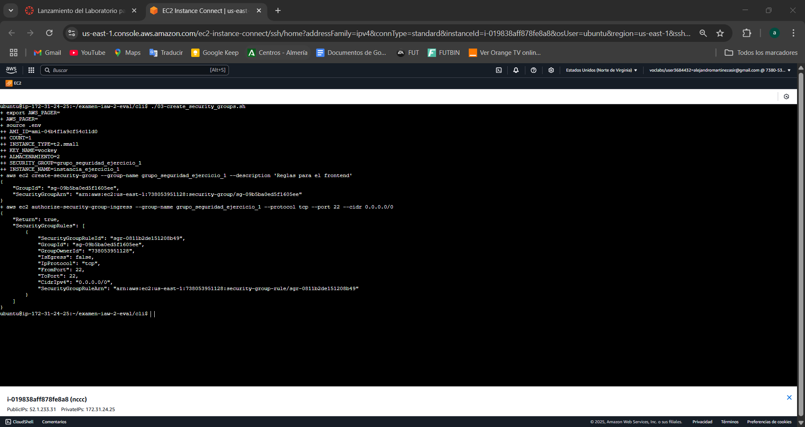
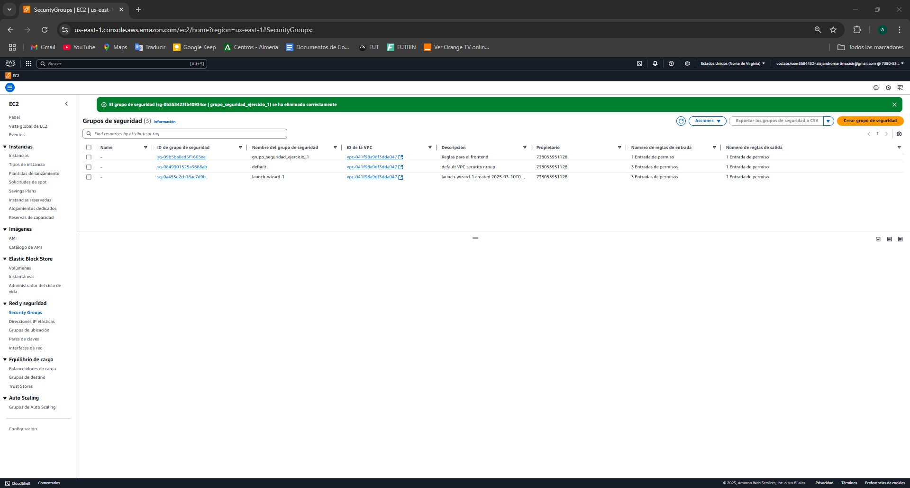
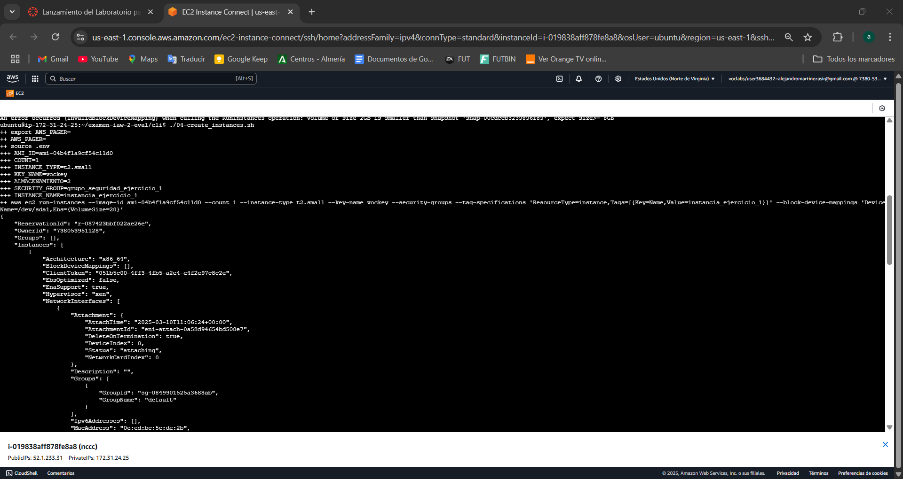
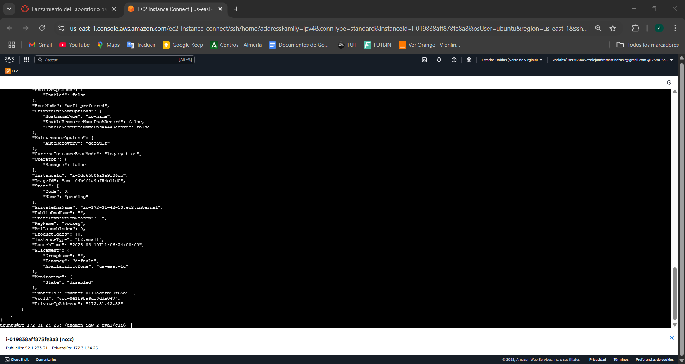
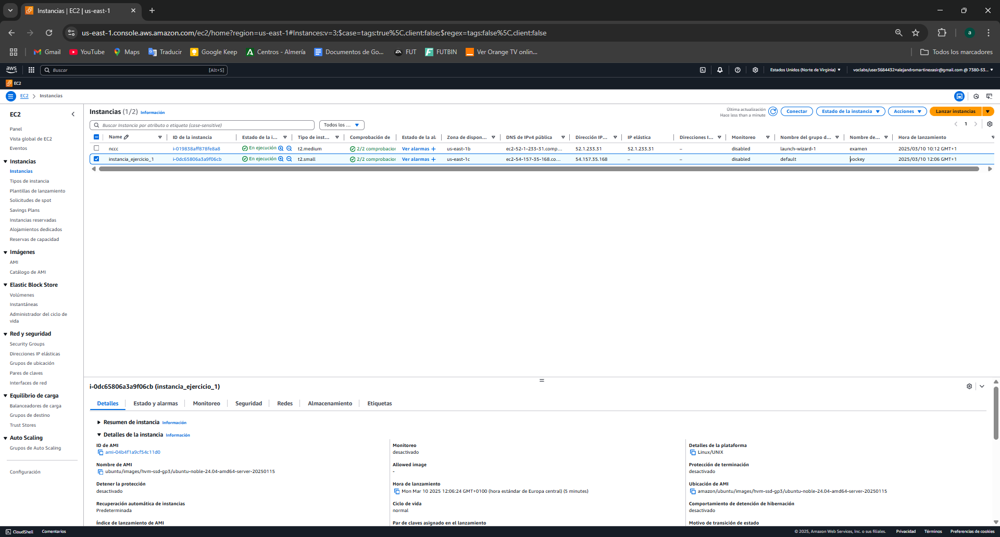

# examen-iaw-2-eval
## Ejercicio 1
Hemos ejecutado con aws cli una creacion de grupo de seguridad y una nueva instancia
### .env
~~~~
AMI_ID=ami-04b4f1a9cf54c11d0
COUNT=1
INSTANCE_TYPE=t2.small
KEY_NAME=vockey
SECURITY_GROUP=grupo_seguridad_ejercicio_1
INSTANCE_NAME=instancia_ejercicio_1
~~~~
### 03-create-security-group.sh
~~~~
#!/bin/bash
set -x

export AWS_PAGER=""

source .env

#Frontend
aws ec2 create-security-group \
    --group-name $SECURITY_GROUP \
    --description "Reglas para el frontend"

aws ec2 authorize-security-group-ingress \
    --group-name $SECURITY_GROUP \
    --protocol tcp \
    --port 22 \
    --cidr 0.0.0.0/0
~~~~
### 04-create_instances.sh
~~~~
# filepath: /home/ubuntu/examen-iaw-2-eval/cli/04-create_instances.sh
#!/bin/bash
set -x

export AWS_PAGER=""

source .env

#Frontend 1
aws ec2 run-instances \
    --image-id $AMI_ID \
    --count $COUNT \
    --instance-type $INSTANCE_TYPE \
    --key-name $KEY_NAME \
    --security-groups $SECURITY_GROUP_FRONTEND \
    --tag-specifications "ResourceType=instance,Tags=[{Key=Name,Value=$INSTANCE_NAME}]" \
    --block-device-mappings "DeviceName=/dev/sda1,Ebs={VolumeSize=20}"
~~~~

### Grupo de seguridad

### Creación de instancia

## Ejercicio 2
Infraestructura como codigo con terraform.
