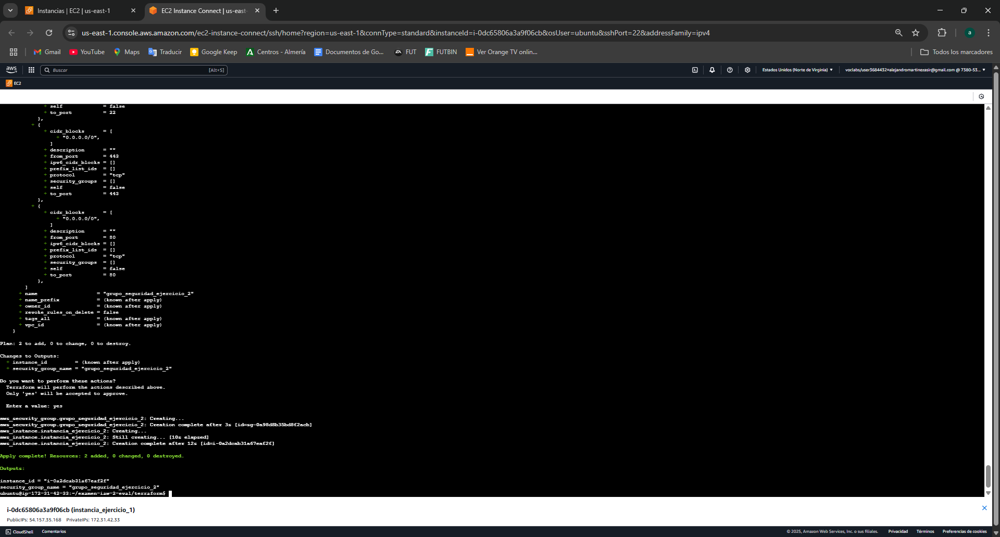

# examen-iaw-2-eval
## Ejercicio 1
Hemos ejecutado con aws cli una creacion de grupo de seguridad y una nueva instancia
### .env
~~~~
AMI_ID=ami-04b4f1a9cf54c11d0
COUNT=1
INSTANCE_TYPE=t2.small
KEY_NAME=vockey
SECURITY_GROUP=grupo_seguridad_ejercicio_1
INSTANCE_NAME=instancia_ejercicio_1
~~~~
### 03-create-security-group.sh
~~~~
#!/bin/bash
set -x

export AWS_PAGER=""

source .env

#Frontend
aws ec2 create-security-group \
    --group-name $SECURITY_GROUP \
    --description "Reglas para el frontend"

aws ec2 authorize-security-group-ingress \
    --group-name $SECURITY_GROUP \
    --protocol tcp \
    --port 22 \
    --cidr 0.0.0.0/0
~~~~
### 04-create_instances.sh
~~~~
# filepath: /home/ubuntu/examen-iaw-2-eval/cli/04-create_instances.sh
#!/bin/bash
set -x

export AWS_PAGER=""

source .env

#Frontend 1
aws ec2 run-instances \
    --image-id $AMI_ID \
    --count $COUNT \
    --instance-type $INSTANCE_TYPE \
    --key-name $KEY_NAME \
    --security-groups $SECURITY_GROUP_FRONTEND \
    --tag-specifications "ResourceType=instance,Tags=[{Key=Name,Value=$INSTANCE_NAME}]" \
    --block-device-mappings "DeviceName=/dev/sda1,Ebs={VolumeSize=20}"
~~~~

### Grupo de seguridad

### Creación de instancia

## Ejercicio 2
Infraestructura como codigo con terraform.
### variables.tf
~~~~
variable "region" {
  description = "La región de AWS a utilizar"
  default     = "us-east-1"
}

variable "ami_id" {
  description = "ID de la AMI para la instancia EC2"
  default     = "ami-04b4f1a9cf54c11d0"
}

variable "instance_type" {
  description = "Tipo de instancia EC2"
  default     = "t2.medium"
}

variable "key_name" {
  description = "Nombre de la clave SSH"
  default     = "vockey"
}

variable "security_group_name" {
  description = "Nombre del grupo de seguridad"
  default     = "grupo_seguridad_ejercicio_2"
}

variable "instance_name" {
  description = "Nombre de la instancia EC2"
  default     = "instancia_ejercicio_2"
}

variable "volume_size" {
  description = "Tamaño del volumen EBS en GB"
  default     = 30
}
~~~~
### main.tf
~~~~
# Configuramos el proveedor de AWS
provider "aws" {
  region = var.region
}

#----------------------------------------------------------------
# Creamos un grupo de seguridad
resource "aws_security_group" "grupo_seguridad_ejercicio_2" {
  name        = var.security_group_name
  description = "Grupo de seguridad para la instancia de ejercicio 2"

  # Reglas de entrada para permitir el tráfico SSH, HTTP y HTTPS
  ingress {
    from_port   = 22
    to_port     = 22
    protocol    = "tcp"
    cidr_blocks = ["0.0.0.0/0"]
  }

  ingress {
    from_port   = 80
    to_port     = 80
    protocol    = "tcp"
    cidr_blocks = ["0.0.0.0/0"]
  }

  ingress {
    from_port   = 443
    to_port     = 443
    protocol    = "tcp"
    cidr_blocks = ["0.0.0.0/0"]
  }

  # Reglas de salida para permitir todas las conexiones salientes
  egress {
    from_port   = 0
    to_port     = 0
    protocol    = "-1"
    cidr_blocks = ["0.0.0.0/0"]
  }
}

# Creamos una instancia EC2
resource "aws_instance" "instancia_ejercicio_2" {
  ami             = var.ami_id
  instance_type   = var.instance_type
  key_name        = var.key_name
  security_groups = [aws_security_group.grupo_seguridad_ejercicio_2.name]

  root_block_device {
    volume_size = var.volume_size
  }

  tags = {
    Name = var.instance_name
  }
}
~~~~

### output.tf
~~~~
# Mostramos el ID de la instancia
output "instance_id" {
  description = "El ID de la instancia EC2"
  value       = aws_instance.instancia_ejercicio_2.id
}

# Mostramos el nombre del grupo de seguridad
output "security_group_name" {
  description = "El nombre del grupo de seguridad"
  value       = aws_security_group.grupo_seguridad_ejercicio_2.name
}
~~~~

### Grupo de seguridad

### Instancia

## Ejercicio 3
Instalaremos docker y docker compose a traves de ansible
### inventario
~~~~
[ejercicio2]
172.31.28.102

[all:vars]
ansible_user=ubuntu
ansible_ssh_private_key_file=/home/ubuntu/examen-iaw-2-eval/ansible/examen.pem
ansible_ssh_common_args='-o StrictHostKeyChecking=accept-new'
~~~~
### playbook
~~~~
- name: Instalar Docker y Docker Compose
  hosts: ejercicio2
  become: yes
  vars_files:
    - vars/variables.yaml

  tasks:
    - name: Update apt cache
      apt:
        update_cache: yes

    - name: Remove existing Docker
      apt:
        name: "{{ item }}"
        state: absent
      loop:
        - docker.io
        - docker-compose

    - name: Install Docker
      apt:
        name: "{{ docker_package }}"
        state: present

    - name: Install Docker Compose
      apt:
        name: "{{ docker_compose_package }}"
        state: present
~~~~

### Variables
~~~~
docker_package: docker.io
docker_compose_package: docker-compose
~~~~
### Ejecución

## Ejercicio 4
Creacion de una imagen docker
### Dockerfile
~~~~
FROM ubuntu:24.04

RUN apt update \
    && apt install nginx -y && \
    apt install git -y && \
    rm -rf /var/lib/apt/lists/*

    RUN git clone https://github.com/AlejandroMartinezASIR/MKDOKS.git /site \
    && cp -R /site/* /usr/share/nginx/html/

    EXPOSE 80

CMD ["nginx", "-g", "daemon off;"]
~~~~
Creamos un contenedor en el puerto 80
~~~~
docker run -d -p 8080:80 --name my-nginx-container my-nginx-image
~~~~
## Ejercicio 5
Publicar imagen en dockerhub
~~~~
name: Build and Test Docker Image

on:
  push:
    branches:
      - main  # Cambia 'main' por la rama que prefieras

jobs:
  build:
    runs-on: ubuntu-latest

    steps:
    - name: Checkout repository
      uses: actions/checkout@v2

    - name: Set up Docker Buildx
      uses: docker/setup-buildx-action@v2

    - name: Log in to Docker Hub
      uses: docker/login-action@v2
      with:
        username: ${{ secrets.DOCKER_USERNAME }}
        password: ${{ secrets.DOCKER_PASSWORD }}

    - name: Build Docker image
      uses: docker/build-push-action@v4
      with:
        context: .
        push: false
        tags: my-nginx-image:latest

    - name: Run Docker container
      run: docker run -d -p 8080:80 --name my-nginx-container my-nginx-image:latest

    - name: Test Docker container
      run: |
        sleep 10  # Esperar a que el contenedor esté listo
        curl -f http://localhost:8080 || (docker logs my-nginx-container && exit 1)

    - name: Stop and remove Docker container
      run: docker rm -f my-nginx-container
~~~~
